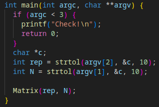

​    				МИНИСТЕРСТВО ОБРАЗОВАНИЯ И НАУКИ РОССИЙСКОЙ ФЕДЕРАЦИИ

​				НОВОСИБИРСКИЙ ГОСУДАРСТВЕННЫЙ ТЕХНИЧЕСКИЙ УНИВЕРСИТЕТ

 

 

 

 

​											Кафедра ВТ

​										     Аудитория 7-320

 

 

 

​									     Лабораторная работа № 3

​								      **Оптимизация доступа к памяти**

 

 

 

 

 

 

 

Факультет: ФТФ

Группа: ФФ-11

Студент: Дмитриев Д.Д.

Преподаватель: Скороходов Ф.А.

Дата выполнения работы: 01.12.2023

Отметка о защите:

 

 

​	 

​										Новосибирск, 2023

# **Задания и выполнение.**

## Задание 1.

​	На языке С/С++/C# реализовать функцию DGEMM BLAS последовательное
умножение двух квадратных матриц с элементами типа double. Обеспечить
возможность задавать размерности матриц в качестве аргумента командной строки
при запуске программы. Инициализировать начальные значения матриц случайными
числами.

### Решение:

​	Квадратные матрицы задаются динамически:

​	Заполняются случайными элементами типа double от 0 до 1000:

​							 

​	В функции main принимаются 2 значения - размер матрицы и количество повторов:

​	В терминале ввод пользователя выглядит так - название, размер, повторы:

​	Перемножение квадратных матриц DGEMM BLAS:

## Задание 2.

​	Провести серию испытаний и построить график зависимости времени
выполнения программы от объёма входных данных. Например, для квадратных
матриц с числом строк/столбцов 1000, 2000, 3000, ... 10000.

### Решение:

​	Был написан простой bash скрипт, который автоматически запускал тесты, по мере выполнения предыдущих:

​											

​	Результат выполнения записывался в файл формата .csv:

​		Запись:

​		Результат:

​	График зависимости времени выполнения программы от объёма входных данных:

## Задание 3.

​	Оценить предельные размеры матриц, которые можно перемножить на вашем
вычислительном устройстве.

### Решение:

​	Всего имеется 16 Гб памяти, свободно система может выделить 15 Гб, соответственно, исходя из вычислений, у моего ВУ есть свободно байт:
$$
15*1024*1024*1024 = 161061273600
$$
 	Тип double занимает 8 байт.
$$
161061273600 / 8 = 20132659200
$$
​	Чтобы найти размер матрицы, нужно взять корень из числа, полученного выше:
$$
sqrt(20132659200) = 44869,4
$$
​	Вывод:

​		Предельный размер матрицы - `44869х44869`.
​		Теоретический предельный размер матрицы, когда доступна вся память(16 Гб) - `46340х46340`.

## Задание 4.

​	Реализовать дополнительную функцию DGEMM_opt_1, в которой
выполняется оптимизация доступа к памяти, за счет построчного перебора
элементов обеих матриц.

### Решение:

## Задание 5.

​	Оценить ускорение умножения для матриц фиксированного размера,
например, 1000х1000, 2000х2000, 5000х5000, 10000х10000.

### Решение:

#### 	1000х1000

​		Без ускорения - 5.648105 сек.
​		С ускорением - 3.081052 сек.
​		Ускорение составляет -  2,567053 сек или 45,45%.

#### 	2000х2000

​		Без ускорения - 46.910169 сек.
​		С ускорением - 24.665492 сек.
​		Ускорение составляет - 22,244677 сек или 47,42%

#### 	5000х5000

​		Без ускорения - 800.732466 сек.
​		С ускорением - 381.320383 сек.
​		Ускорение составляет - 419,412083 сек или 52,38%

#### 	10000х10000	

​		Без ускорения - 11789.486817 сек.
​		С ускорением - 3094.278876 сек.
​		Ускорение составляет - 8695,207941 сек или 73,75%

## Задание 6.

​	С помощью профилировщика для исходной программы и каждого способа
оптимизации доступа к памяти оценить количество промахов при работе к КЭШ
памятью (cache-misses).

### Решение:

​	Исходная программа: 

​	Первый способ оптимизации доступа к памяти DGEMM_opt_1:

​	С оптимизацией количество промахов (cashe-misses) меньше на ~55%, т.е. в ~2 раза.

## Код

#include <math.h>
#include <stdio.h>
#include <stdlib.h>
#include <string.h>
#include <time.h>
#define high 1000.0
#define low 0.0

void csvFile(int size, double *time_spent_1, double *time_spent_2);
void initCSV();
void initMatrix(int N, double *time_spent_1, double *time_spent_2);
void fillMatrix(int N, double **A, double **B);
void commonMultiMatrix(int N, double **A, double **B, double **C);
void DGEMM_opt_1(int N, double **A, double **B, double **C);
// void printMatrix(int N, double **A, double **B, double **C);
void freeMatrix(int N, double **A, double **B, double **C);
void Matrix(int rep, int N);

int main(int argc, char **argv) {
  if (argc < 3) {
    printf("Check!\n");
    return 0;
  }
  char *c;
  int rep = strtol(argv[2], &c, 10);
  int N = strtol(argv[1], &c, 10);

  Matrix(rep, N);
}

void Matrix(int rep, int N) {
  initCSV();
  double time_spent_1 = 0.0;
  double time_spent_2 = 0.0;
  for (int i = 0; i < rep; i++) {
    initMatrix(N, &time_spent_1, &time_spent_2);
    csvFile(N, &time_spent_1, &time_spent_2);
  }
}

void initMatrix(int N, double *time_spent_1, double *time_spent_2) {
  double **A = (double **)malloc(N * sizeof(double *));
  double **B = (double **)malloc(N * sizeof(double *));
  double **C = (double **)malloc(N * sizeof(double *));
  for (int i = 0; i < N; i++) {
    A[i] = (double *)malloc(N * sizeof(double));
    B[i] = (double *)malloc(N * sizeof(double));
    C[i] = (double *)malloc(N * sizeof(double));
  }
  fillMatrix(N, A, B);

  clock_t begin_1 = clock();
  srand(time(NULL));
  commonMultiMatrix(N, A, B, C);
  clock_t end_1 = clock();
  *time_spent_1 += (double)(end_1 - begin_1) / CLOCKS_PER_SEC;

  clock_t begin_2 = clock();
  srand(time(NULL));
  DGEMM_opt_1(N, A, B, C);
  clock_t end_2 = clock();
  *time_spent_2 += (double)(end_2 - begin_2) / CLOCKS_PER_SEC;

  // printMatrix(N, A, B, C);

  freeMatrix(N, A, B, C);
}

void fillMatrix(int N, double **A, double **B) {
  for (int i = 0; i < N; i++)
    for (int j = 0; j < N; j++) {
      A[i][j] = ((double)rand() * (high - low)) / (double)RAND_MAX + low;
      B[i][j] = ((double)rand() * (high - low)) / (double)RAND_MAX + low;
    }
}

void commonMultiMatrix(int N, double **A, double **B, double **C) {
  for (int i = 0; i < N; i++)
    for (int j = 0; j < N; j++) {
      C[i][j] = 0;
      for (int k = 0; k < N; k++) C[i][j] += A[i][k] * B[k][j];
    }
}

void DGEMM_opt_1(int N, double **A, double **B, double **C) {
  for (int i = 0; i < N; i++)
    for (int j = 0; j < N; j++) {
      C[i][j] = 0;
    }
  for (int i = 0; i < N; i++) {
    for (int j = 0; j < N; j++) {
      for (int k = 0; k < N; k++) C[i][k] += A[i][j] * B[j][k];
    }
  }
}

// void printMatrix(int N, double **A, double **B, double **C) {
//   printf("matrix A\n");
//   for (int i = 0; i < N; i++) {
//     for (int j = 0; j < N; j++) printf("%f ", A[i][j]);
//     printf("\n");
//   }
//   printf("\nmatrix B\n");
//   for (int i = 0; i < N; i++) {
//     for (int j = 0; j < N; j++) printf("%f ", B[i][j]);
//     printf("\n");
//   }
//   printf("\nthe result of multiplying\n");
//   for (int i = 0; i < N; i++) {
//     for (int j = 0; j < N; j++) printf("%3f ", C[i][j]);
//     printf("\n");
//   }
// }

void freeMatrix(int N, double **A, double **B, double **C) {
  for (int i = 0; i < N; i++) {
    free(A[i]);
    free(B[i]);
    free(C[i]);
  }
  free(A);
  free(B);
  free(C);
}

void initCSV() {
  FILE *file;
  file = fopen("csvFile.csv", "a");
  if (file == NULL) {
    printf("Error!\n");
    exit(0);
  }
  fprintf(file, "Size; DGEMMBLAS_Time;DGEMM_opt_1_Time\n");
  fclose(file);
}

void csvFile(int size, double *time_spent_1, double *time_spent_2) {
  FILE *file;
  file = fopen("csvFile.csv", "a");
  if (file == NULL) {
    printf("Error!\n");
    exit(0);
  }
  fprintf(file, "%d;%f;%f\n", size, *time_spent_1, *time_spent_2);
  fclose(file);
}